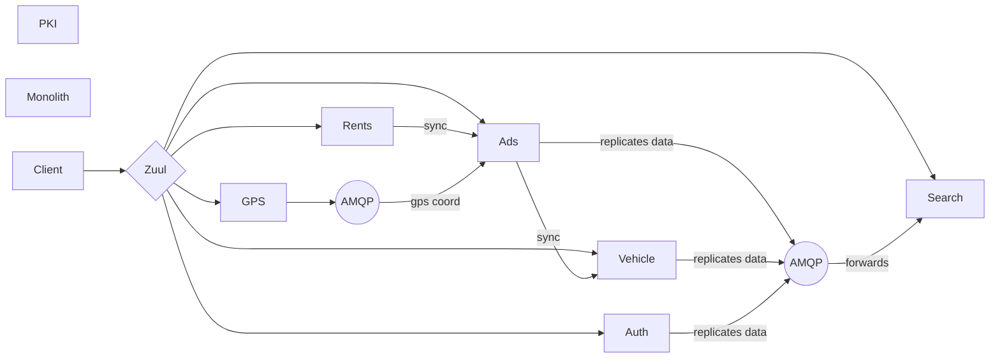

```mermaid
graph LR
P[PKI]
MONO[Monolith]
V[Vehicle]
O[Ads]
S[Search]
R[Rents]
W[Client]
Z{Zuul}

Z --> V
Z --> S
Z --> R
Z --> O
Z --> A[Auth]
Z --> G[GPS]
W --> Z
O -- replicates data --> Q1((AMQP))
V -- replicates data--> Q1
A -- replicates data--> Q1
O -- sync--> V
R -- sync --> O
G --> Q2((AMQP))
Q2 -- gps coord--> O
Q1 -- forwards--> S

```