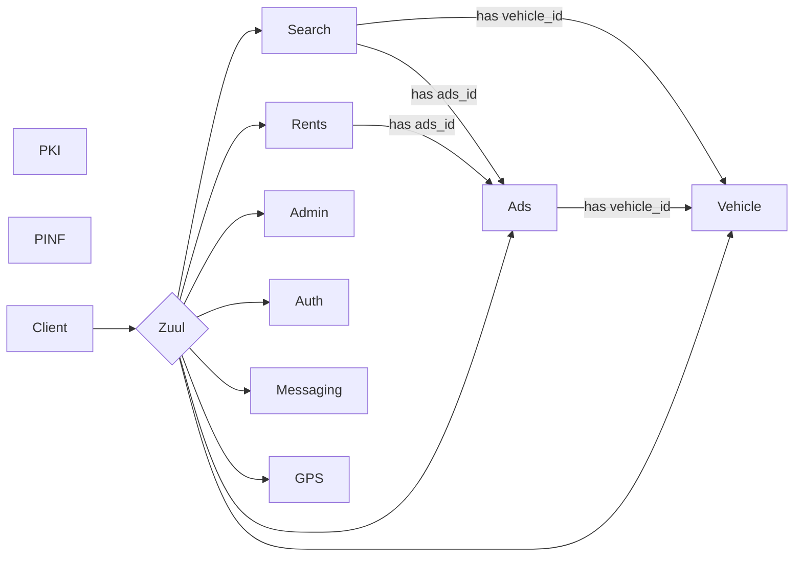

```mermaid
graph LR
P[PKI]
PINF[PINF]
S[Search] -- has ads_id--> O[Ads]
S -- has vehicle_id --> V[Vehicle]
O -- has vehicle_id --> V
R[Rents] -- has ads_id --> O

Z{Zuul} --> V
Z{Zuul} --> B[Admin]
Z{Zuul} --> S
Z{Zuul} --> R
Z{Zuul} --> O
Z{Zuul} --> A[Auth]
Z{Zuul} --> E[Messaging]
Z{Zuul} --> G[GPS]
W[Client] --> Z
```